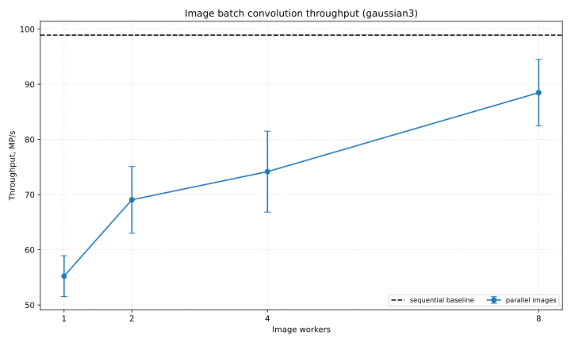
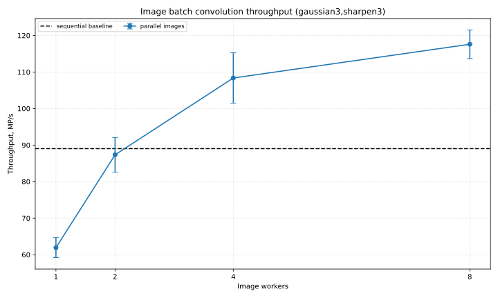

# Анализ производительности
Эксперимент проводился на машине со следующими характеристиками: macOS 15.7.7, MacBook Air, Apple M3 CPU с 8 ядрами, 16 GB LPDDR5 RAM, Apple M3 GPU с 8 ядрами. macOS фиксированную частоту CPU не показывает.

## Результаты измерений

### Таблица измерений

Использовались все 6 изображений из директории images.

| kernel_set | mode | strategy | threads | avg_ms | min_ms | max_ms | stddev_ms | ci95_low_ms | ci95_high_ms | throughput_mp_s | throughput_ci95_low_mp_s | throughput_ci95_high_mp_s | kernel_count |
| --- | --- | --- | --- | --- | --- | --- | --- | --- | --- | --- | --- | --- | --- |
| gaussian3 | sequential | sequential | 1 | 187.113717 | 186.544708 | 188.382125 | 0.458734 | 186.881565 | 187.345868 | 98.898968 | 98.776680 | 99.021256 | 1 |
| gaussian3 | parallel | images | 1 | 341.179589 | 302.043583 | 419.614792 | 49.342927 | 316.208622 | 366.150556 | 55.226244 | 51.521566 | 58.930923 | 1 |
| gaussian3 | parallel | images | 2 | 276.621494 | 232.607833 | 366.590166 | 53.839523 | 249.374937 | 303.868052 | 69.068190 | 63.006862 | 75.129518 | 1 |
| gaussian3 | parallel | images | 4 | 258.792364 | 197.402833 | 324.789959 | 51.026871 | 232.969204 | 284.615524 | 74.164715 | 66.829361 | 81.500069 | 1 |
| gaussian3 | parallel | images | 8 | 214.137400 | 194.673708 | 319.499959 | 39.656868 | 194.068256 | 234.206544 | 88.468876 | 82.453265 | 94.484486 | 1 |
| gaussian3,sharpen3 | sequential | sequential | 1 | 415.700061 | 415.065125 | 416.755458 | 0.469438 | 415.462493 | 415.937629 | 89.031846 | 88.980999 | 89.082694 | 2 |
| gaussian3,sharpen3 | parallel | images | 1 | 601.797589 | 530.811709 | 656.743500 | 50.744130 | 576.117516 | 627.477662 | 61.925319 | 59.188624 | 64.662013 | 2 |
| gaussian3,sharpen3 | parallel | images | 2 | 428.619333 | 385.534458 | 497.598458 | 49.167269 | 403.737262 | 453.501404 | 87.350111 | 82.611442 | 92.088780 | 2 |
| gaussian3,sharpen3 | parallel | images | 4 | 347.324967 | 312.767208 | 443.740000 | 49.697741 | 322.174440 | 372.475494 | 108.375574 | 101.481414 | 115.269734 | 2 |
| gaussian3,sharpen3 | parallel | images | 8 | 316.304872 | 305.610125 | 408.389000 | 26.100929 | 303.095980 | 329.513765 | 117.604849 | 113.683885 | 121.525814 | 2 |

### Графики

На графике показана зависимость пропускной способности обработки нескольких изображений от количества выделенных потоков. Обработка проводится с одним ядром gaussian3. Видно, что последовательная обработка имеет пропускную способность выше, чем параллельная, так как для каждого изображения выполняется слишком маленькая работа, поэтому накладные расходы превышают выигрыш от распараллеливания. 

На графике показана та же зависимость, что и на предыдущем, но для свёртки последовательно применяются ядра gaussian3 и sharpen3. По сравнению с предыдущим экспериментом работы на каждое изображение стало больше, поэтому распараллеливание стало более эффективным, и пропускная способность параллельной обработки стала выше, чем у последовательной.
