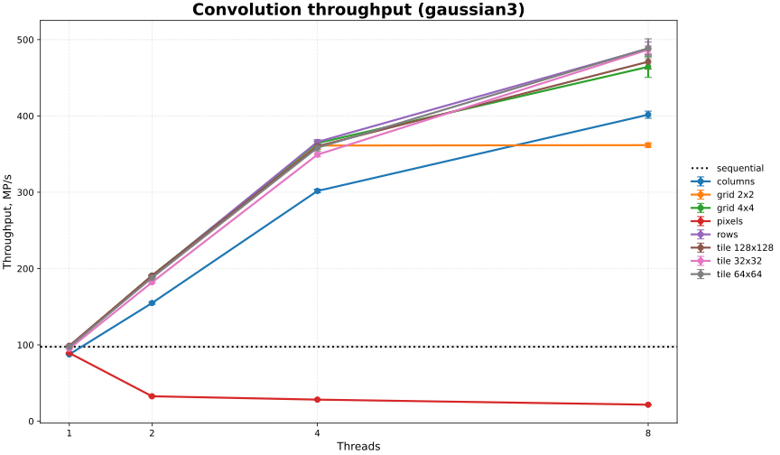

# Анализ производительности
Эксперимент проводился на машине со следующими характеристиками: macOS 15.7.7, MacBook Air, Apple M3 CPU с 8 ядрами, 16 GB LPDDR5 RAM, Apple M3 GPU с 8 ядрами. macOS фиксированную частоту CPU не показывает.

## Результаты измерений

Ядро свёртки: `gaussian3`.

Размер изображения fox.bmp: 2464 x 1412 пикселей.

| strategy   | partition_kind | partition_value | threads | avg_ms     | min_ms     | max_ms     | stddev_ms | ci95_low_ms | ci95_high_ms | throughput_mp_s | throughput_ci95_low_mp_s | throughput_ci95_high_mp_s |
|------------|----------------|-----------------|---------|------------|------------|------------|-----------|-------------|--------------|-----------------|--------------------------|---------------------------|
| sequential | none           | -               | 1       | 35.706878  | 34.784208  | 37.341875  | 0.758688  | 35.322929   | 36.090827    | 97.477332       | 96.445753                | 98.508912                 |
| pixels     | none           | -               | 1       | 38.955314  | 38.332459  | 40.153666  | 0.439817  | 38.732736   | 39.177892    | 89.322240       | 88.819319                | 89.825161                 |
| rows       | none           | -               | 1       | 35.227875  | 34.960041  | 35.719541  | 0.212832  | 35.120167   | 35.335583    | 98.765140       | 98.464459                | 99.065822                 |
| columns    | none           | -               | 1       | 39.751442  | 39.227875  | 40.233417  | 0.286755  | 39.606323   | 39.896560    | 87.527315       | 87.207807                | 87.846824                 |
| grid       | grid           | 2x2             | 1       | 35.236372  | 34.970125  | 35.804875  | 0.249382  | 35.110168   | 35.362577    | 98.742557       | 98.391473                | 99.093640                 |
| grid       | grid           | 4x4             | 1       | 35.559728  | 35.198875  | 37.073000  | 0.495082  | 35.309182   | 35.810274    | 97.857317       | 97.187501                | 98.527132                 |
| grid       | tile           | 32x32           | 1       | 36.646395  | 35.969125  | 37.088916  | 0.311479  | 36.488765   | 36.804024    | 94.945340       | 94.533800                | 95.356881                 |
| grid       | tile           | 64x64           | 1       | 35.720978  | 35.420000  | 36.130958  | 0.184447  | 35.627635   | 35.814321    | 97.400867       | 97.147436                | 97.654298                 |
| grid       | tile           | 128x128         | 1       | 35.391764  | 35.250333  | 35.690833  | 0.156303  | 35.312664   | 35.470864    | 98.306235       | 98.087437                | 98.525034                 |
| pixels     | none           | -               | 2       | 106.870856 | 99.278542  | 117.567000 | 4.554990  | 104.565712  | 109.175999   | 32.609167       | 31.917432                | 33.300902                 |
| rows       | none           | -               | 2       | 18.318461  | 18.148250  | 18.669375  | 0.178265  | 18.228247   | 18.408676    | 189.943501      | 189.016865               | 190.870137                |
| columns    | none           | -               | 2       | 22.482153  | 21.733333  | 23.283625  | 0.474377  | 22.242085   | 22.722221    | 154.817026      | 153.157035               | 156.477017                |
| grid       | grid           | 2x2             | 2       | 18.286422  | 18.093167  | 18.627292  | 0.203578  | 18.183397   | 18.389447    | 190.281519      | 189.215578               | 191.347461                |
| grid       | grid           | 4x4             | 2       | 18.261758  | 18.065584  | 18.745792  | 0.215349  | 18.152777   | 18.370740    | 190.541079      | 189.415229               | 191.666929                |
| grid       | tile           | 32x32           | 2       | 19.121575  | 18.890834  | 19.631333  | 0.216260  | 19.012132   | 19.231018    | 181.971307      | 180.943323               | 182.999291                |
| grid       | tile           | 64x64           | 2       | 18.507408  | 18.395625  | 18.822333  | 0.130973  | 18.441127   | 18.573690    | 187.996550      | 187.330276               | 188.662824                |
| grid       | tile           | 128x128         | 2       | 18.237692  | 18.126250  | 18.552500  | 0.149770  | 18.161898   | 18.313486    | 190.779883      | 189.995350               | 191.564416                |
| pixels     | none           | -               | 4       | 123.311592 | 119.402875 | 133.228750 | 3.485566  | 121.547652  | 125.075531   | 28.234697       | 27.845904                | 28.623490                 |
| rows       | none           | -               | 4       | 9.509681   | 9.402167   | 9.837625   | 0.159100  | 9.429165    | 9.590196     | 365.948807      | 362.921513               | 368.976101                |
| columns    | none           | -               | 4       | 11.534620  | 11.386459  | 11.899417  | 0.178398  | 11.444338   | 11.624902    | 301.694633      | 299.369870               | 304.019397                |
| grid       | grid           | 2x2             | 4       | 9.639872   | 9.435375   | 10.236958  | 0.280458  | 9.497941    | 9.781804     | 361.190220      | 356.047826               | 366.332614                |
| grid       | grid           | 4x4             | 4       | 9.549867   | 9.439958   | 9.867000   | 0.160937  | 9.468422    | 9.631312     | 364.410330      | 361.371091               | 367.449569                |
| grid       | tile           | 32x32           | 4       | 9.963600   | 9.803458   | 10.268583  | 0.157785  | 9.883750    | 10.043450    | 349.268477      | 346.507582               | 352.029373                |
| grid       | tile           | 64x64           | 4       | 9.713842   | 9.553750   | 10.400125  | 0.241588  | 9.591581    | 9.836102     | 358.364671      | 354.032386               | 362.696957                |
| grid       | tile           | 128x128         | 4       | 9.655564   | 9.470958   | 9.937917   | 0.121603  | 9.594024    | 9.717104     | 360.380848      | 358.096359               | 362.665337                |
| pixels     | none           | -               | 8       | 161.366297 | 158.185500 | 165.082833 | 2.538605  | 160.081586  | 162.651009   | 21.565648       | 21.394590                | 21.736707                 |
| rows       | none           | -               | 8       | 7.134322   | 6.794458   | 7.658750   | 0.255865  | 7.004837    | 7.263808     | 488.243440      | 479.511935               | 496.974945                |
| columns    | none           | -               | 8       | 8.667350   | 8.351375   | 9.046125   | 0.200737  | 8.565763    | 8.768937     | 401.610950      | 396.923880               | 406.298021                |
| grid       | grid           | 2x2             | 8       | 9.620889   | 9.494167   | 9.906792   | 0.156201  | 9.541840    | 9.699938     | 361.714077      | 358.787946               | 364.640209                |
| grid       | grid           | 4x4             | 8       | 7.520278   | 7.180750   | 9.192291   | 0.509240  | 7.262567    | 7.777989     | 464.355097      | 450.562296               | 478.147898                |
| grid       | tile           | 32x32           | 8       | 7.149239   | 7.000417   | 7.481750   | 0.146932  | 7.074881    | 7.223597     | 486.835720      | 481.901353               | 491.770087                |
| grid       | tile           | 64x64           | 8       | 7.139611   | 6.827333   | 8.497417   | 0.410477  | 6.931881    | 7.347341     | 488.626677      | 476.135460               | 501.117894                |
| grid       | tile           | 128x128         | 8       | 7.398150   | 7.072500   | 7.968417   | 0.307492  | 7.242538    | 7.553762     | 471.015450      | 461.354857               | 480.676043                |

На этом графике показана зависимость времени выполнения свёртки от числа потоков и стратегии. Видно, что стратегия pixels сильно проигрывает по скорости остальным стратегиям. Это происходит из-за того, что потоки постоянно обращаются к одной и той же атомарной переменной, отвечающей за индекс пикселя. Атомарная операция `getAndIncrement()` дороже обычного инкремента, потому что требует синхронизации со всеми потоками. Все остальные стратегии при увеличении числа потоков завершают свёртку быстрее, чем последовательная, потому что потоки меньше мешают друг другу.

На этом графике показана зависимость пропускной способности свёртки от числа потоков и стратегии. Throughput стратегии pixels ниже, чем у всех остальных стратегий по описанной выше причине. Также видно, что при увеличении числа потоков прирост становится меньше, что объясняется законом Амдала. Throughput стратегии grid 2x2 перестаёт расти при увеличении числа потоков с 4 до 8, потому что объём работы на каждый поток слишком маленький, из-за чего потоки могут мешать друг другу, как в стратегии pixels. 
